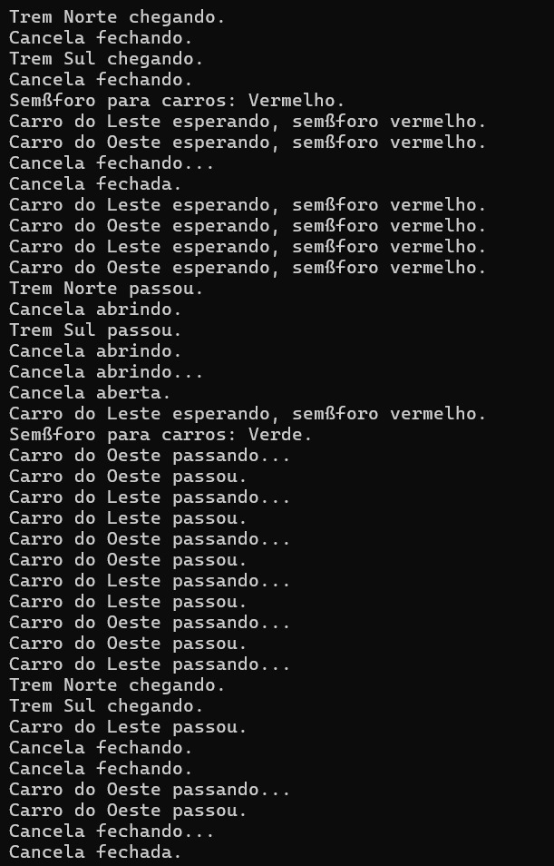
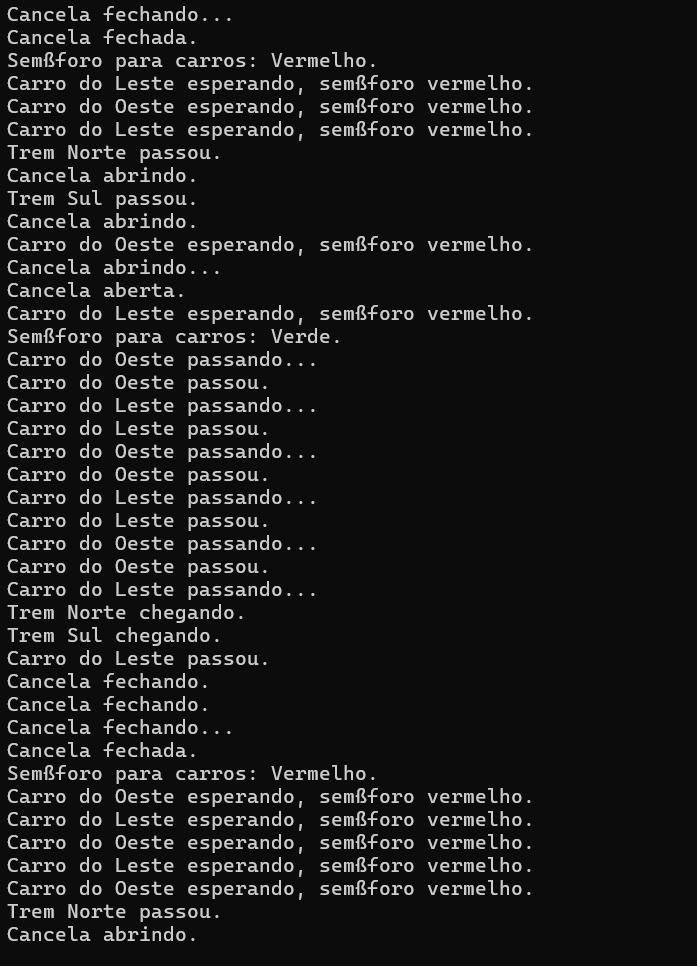

# Simulação de cruzamento de trilhos de trem

Link do Youtube [Link](https://youtu.be/EQorYHqA1O4)

Este projeto implementa uma simulação de um cruzamento de uma via ferroviária com uma via de carros utilizando o FreeRTOS. O sistema garante a segurança dos veículos e trens no cruzamento, controlando uma cancela e semáforos com base na aproximação de trens. O cenário considerado é ilustrado na figura a seguir.
<p align="center">
  
</p>

## Pré-requisitos

- Microsoft Visual Studio (Community, Professional ou Enterprise)
- FreeRTOS Kernel

## Passos para Configurar o Projeto

### 1. Instale o Visual Studio

Certifique-se de ter o Visual Studio instalado em sua máquina. Você pode baixar a versão Community gratuitamente [aqui](https://visualstudio.microsoft.com/).

### 2. Baixe o FreeRTOS

Baixe o FreeRTOS a partir do [site oficial do FreeRTOS](https://www.freertos.org).

### 3. Crie um Novo Projeto

1. Abra o Visual Studio.
2. Vá para `File` > `New` > `Project`.
3. Escolha `Empty Project` em `Visual C++`.
4. Dê um nome ao seu projeto e clique em `Create`.

### 4. Configure o Projeto

1. Clique com o botão direito do mouse no nome do projeto no `Solution Explorer` e selecione `Properties`.
2. Em `Configuration Properties`, configure as propriedades conforme necessário. Certifique-se de que a configuração está definida para `All Configurations`.

### 5. Incluir Diretórios de Cabeçalho

1. Em `Configuration Properties` > `C/C++` > `General`, adicione os diretórios de cabeçalho do FreeRTOS na opção `Additional Include Directories`. Esses diretórios podem ser algo como:

    ```
    path\to\FreeRTOS\Source\include
    path\to\FreeRTOS\Source\portable\MSVC-MingW
    ```

### 6. Adicionar Diretórios de Biblioteca

1. Em `Configuration Properties` > `Linker` > `General`, adicione os diretórios das bibliotecas na opção `Additional Library Directories` se necessário.

### 7. Adicionar Bibliotecas

1. Em `Configuration Properties` > `Linker` > `Input`, adicione as bibliotecas necessárias na opção `Additional Dependencies`.

### 8. Adicionar Arquivos do FreeRTOS ao Projeto

1. Copie os arquivos fonte do FreeRTOS para a pasta do seu projeto ou crie links para os arquivos. Os arquivos necessários geralmente incluem:
    - `FreeRTOS/Source/tasks.c`
    - `FreeRTOS/Source/queue.c`
    - `FreeRTOS/Source/list.c`
    - `FreeRTOS/Source/timers.c`
    - `FreeRTOS/Source/portable/MSVC-MingW/port.c`
    - `FreeRTOS/Source/portable/MemMang/heap_4.c` (ou qualquer outro gerenciador de heap que você esteja usando)

## Funcionalidades

- **Detecção de Trens**: O sistema detecta a aproximação de trens tanto do norte quanto do sul.
- **Controle de Cancela**: Automaticamente fecha quando um trem está se aproximando e abre quando o trem passa.
- **Semáforos para Carros**: Controla um semáforo que indica se os carros podem passar ou devem esperar.
- **Prioridade de Trens**: Trens têm prioridade sobre os carros, garantindo que não haja colisões no cruzamento.

## Estrutura do Projeto

O projeto é estruturado em várias tasks do FreeRTOS que gerenciam diferentes partes do sistema:

- **TaskTrem**: Simula a detecção e o tráfego de trens.
- **TaskCarro**: Gerencia o tráfego de carros tentando cruzar a via férrea.
- **TaskCancela**: Controla a abertura e fechamento da cancela baseada na presença de trens.
- **TaskSemaforo**: Atualiza o estado do semáforo para carros baseado no estado da cancela.


## Resultados esperados

Após processar o arquivo de entrada, a saída esperada é exibida abaixo: 

<p align="center">
  
  <br>
  

</p>

